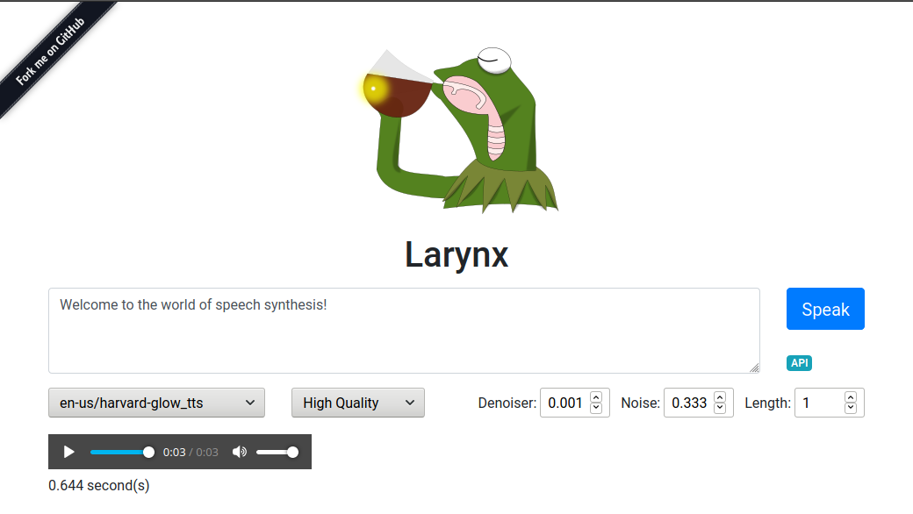
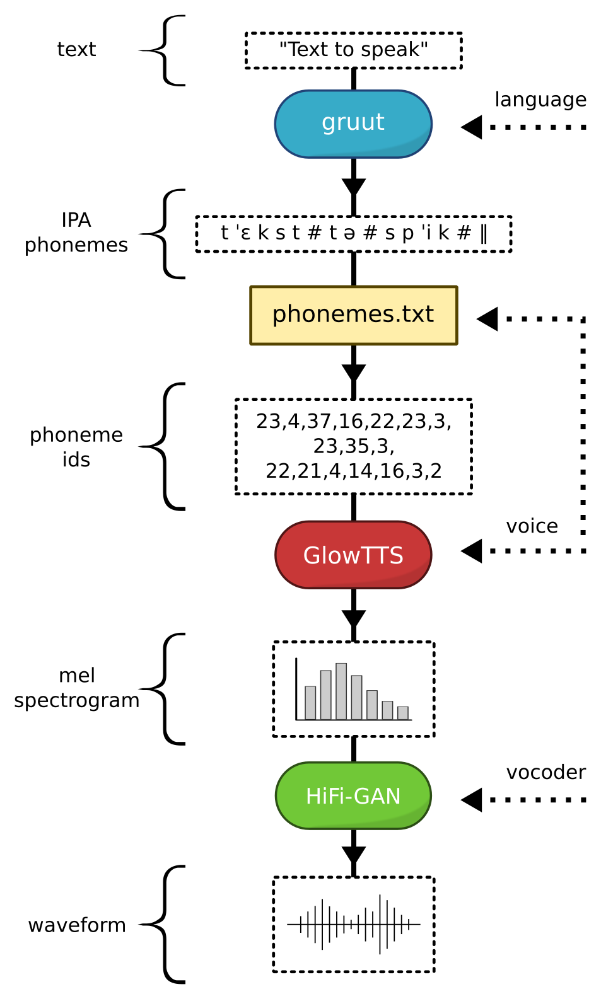

# Larynx

🎥 [DEMO VIDEO](https://www.youtube.com/watch?v=hBmhDf8cl0k)

Offline end-to-end text to speech system using [gruut](https://github.com/rhasspy/gruut) and [onnx](https://onnx.ai/) ([architecture](#architecture)). There are [50 voices available across 9 languages](#samples).

```sh
curl https://raw.githubusercontent.com/rhasspy/larynx/master/docker/larynx-server \
    > ~/bin/larynx-server && chmod +755 ~/bin/larynx-server
larynx-server
```

Visit http://localhost:5002 for the test page. See http://localhost:5002/openapi/ for HTTP endpoint documentation.



Supports a [subset of SSML](#ssml) that can use multiple voices and languages!

``` xml
<speak>
  The 1st thing to remember is that 9 languages are supported in Larynx TTS as of 10/19/2021 at 10:39am.

  <voice name="harvard">
    <s>
      The current voice can be changed!
    </s>
  </voice>

  <voice name="northern_english_male">
    <s>Breaks are possible</s>
    <break time="0.5s" />
    <s>between sentences.</s>
  </voice>

  <s lang="en">
    One language is never enough
  </s>
  <s lang="de">
   Eine Sprache ist niemals genug
  </s>
  <s lang="sw">
    Lugha moja haitoshi
  </s>
</speak>
```

Larynx's goals are:

* "Good enough" synthesis to avoid using a cloud service
* Faster than realtime performance on a Raspberry Pi 4 (with low quality vocoder)
* Broad language support (9 languages)
* Voices trained purely from public datasets

You can use Larynx to:

* Host a [text to speech HTTP endpoint](#docker-installation)
* Synthesize text [on the command-line](#basic-synthesis)
* [Read a book](#long-texts) to you

## Samples

[Listen to voice samples](https://rhasspy.github.io/larynx/) from all of the [pre-trained voices](https://github.com/rhasspy/larynx/releases).

---

## Docker Installation

Pre-built Docker images are available for the following platforms:

* `linux/amd64` - desktop/laptop/server
* `linux/arm64` - Raspberry Pi 64-bit
* `linux/arm/v7` - Raspberry Pi 32-bit

These images include a single English voice, but [many more can be downloaded](https://github.com/rhasspy/larynx/releases/tag/2021-03-28) from within the web interface.

The [larynx](https://raw.githubusercontent.com/rhasspy/larynx/master/docker/larynx) and [larynx-server](https://raw.githubusercontent.com/rhasspy/larynx/master/docker/larynx-server) shell scripts wrap the Docker images, allowing you to use Larynx as a command-line tool.

To manually run the Larynx web server in Docker:

```sh
docker run \
    -it \
    -p 5002:5002 \
    -e "HOME=${HOME}" \
    -v "$HOME:${HOME}" \
    -v /etc/ssl/certs:/etc/ssl/certs \
    -w "${PWD}" \
    --user "$(id -u):$(id -g)" \
    rhasspy/larynx
```

Downloaded voices will be stored in `${HOME}/.local/share/larynx`.

Visit http://localhost:5002 for the test page. See http://localhost:5002/openapi/ for HTTP endpoint documentation.

## Debian Installation

Pre-built Debian packages for [bullseye](https://www.debian.org/releases/bullseye/) are [available for download](https://github.com/rhasspy/larynx/releases/latest) with the name `larynx-tts_<VERSION>_<ARCH>.deb` where `ARCH` is one of `amd64` (most desktops, laptops), `armhf` (32-bit Raspberry Pi), and `arm64` (64-bit Raspberry Pi)
    
Example installation on a typical desktop:

```sh
sudo apt install ./larynx-tts_<VERSION>_amd64.deb
```

From there, you may run the `larynx` command or `larynx-server` to start the web server (http://localhost:5002).

## Python Installation

You may need to install the following dependencies (besides Python 3.7+):

```sh
sudo apt-get install libopenblas-base libgomp1 libatomic1
```

On 32-bit ARM systems (Raspberry Pi), you will also need:

```sh
sudo apt-get install libatlas3-base libgfortran5
```

Next, create a Python virtual environment:

```sh
python3 -m venv larynx_venv
source larynx_venv/bin/activate

pip3 install --upgrade pip
pip3 install --upgrade wheel setuptools
```

Next, install larynx:

```sh
pip3 install -f 'https://synesthesiam.github.io/prebuilt-apps/' -f 'https://download.pytorch.org/whl/cpu/torch_stable.html' larynx
```

Then run `larynx` or `larynx.server` for the web server. You may also execute the Python module directly with `python3 -m larynx` and `python3 -m larynx.server`.

### Voice/Vocoder Download

Voices and vocoders are automatically downloaded when used on the command-line or in the web server. You can also [manually download each voice](https://github.com/rhasspy/larynx/releases/tag/2021-03-28). Extract them to `${HOME}/.local/share/larynx/voices` so that the directory structure follows the pattern `${HOME}/.local/share/larynx/voices/<language>,<voice>`.

---

## SSML

A subset of [SSML](https://www.w3.org/TR/speech-synthesis11/) is supported (use `--ssml`):

* `<speak>` - wrap around SSML text
    * `lang` - set language for document
* `<s>` - sentence (disables automatic sentence breaking)
    * `lang` - set language for sentence
* `<w>` / `<token>` - word (disables automatic tokenization)
* `<voice name="...">` - set voice of inner text
    * `voice` - name or language of voice
* `<say-as interpret-as="">` - force interpretation of inner text
    * `interpret-as` one of "spell-out", "date", "number", "time", or "currency"
    * `format` - way to format text depending on `interpret-as`
        * number - one of "cardinal", "ordinal", "digits", "year"
        * date - string with "d" (cardinal day), "o" (ordinal day), "m" (month), or "y" (year)
* `<break time="">` - Pause for given amount of time
    * time - seconds ("123s") or milliseconds ("123ms")
* `<mark name="">` - User-defined mark (written to `--mark-file` or part of `TextToSpeechResult`)
    * name - name of mark
* `<sub alias="">` - substitute `alias` for inner text
* `<phoneme ph="...">` - supply phonemes for inner text
    * `ph` - phonemes for each word of inner text, separated by whitespace
    * `alphabet` - if "ipa", phonemes are intelligently split ("aːˈb" -> "aː", "ˈb")

--

## Command-Line Interface

Larynx has a flexible command-line interface, available with:

* The [larynx script](https://raw.githubusercontent.com/rhasspy/larynx/master/docker/larynx) for Docker 
* The `larynx` command from the Debian package
* `larynx` or `python3 -m larynx` for Python installations

### Basic Synthesis

```sh
larynx -v <VOICE> "<TEXT>" > output.wav
```

where `<VOICE>` is a language name (`en`, `de`, etc) or a voice name (`ljspeech`, `thorsten`, etc). `<TEXT>` may contain multiple sentences, which will be combined in the final output WAV file. These can also be [split into separate WAV files](#multiple-wav-output).

To adjust the quality of the output, use `-q <QUALITY>` where `<QUALITY>` is "high" (slowest), "medium", or "low" (fastest).

### SSML Synthesis

```sh
larynx --ssml -v <VOICE> "<SSML>" > output.wav
```

where `<SSML>` is valid [SSML](https://www.w3.org/TR/speech-synthesis11/). Not all features are supported; for example:

* Breaks (pauses) can only occur between sentences and can only be specified in seconds or milliseconds
* Voices can only be referenced by name
* Custom lexicons are not yet supported (you can use `<phoneme ph="...">`, however)

If your SSML contains `<mark>` tags, add `--mark-file <FILE>` to the command-line. As the marks are encountered (between sentences), their names will be written on separate lines to the file.

### CUDA Accelerated Synthesis

The `--cuda` flag will make use of a GPU if its available to PyTorch:

``` sh
larynx --cuda 'This is spoken on the GPU.' > output.wav
```

Adding the `--half` flag will enable half-precision inference, which is often faster:

``` sh
larynx --cuda --half 'This is spoken on the GPU even faster.' > output.wav
```

For CUDA acceleration to work, your voice must contain a PyTorch checkpoint file (`generator.pth`). Older Larynx voices did not have these, so you may need to [re-download your voices](https://github.com/rhasspy/larynx/releases/latest/).

### Long Texts

If your text is very long, and you would like to listen to it as its being synthesized, use the `--raw-stream` option:

```sh
larynx -v en --raw-stream < long.txt | aplay -r 22050 -c 1 -f S16_LE
```

Each input line will be synthesized and written the standard out as raw 16-bit 22050Hz mono PCM. By default, 5 sentences will be kept in an output queue, only blocking synthesis when the queue is full. You can adjust this value with `--raw-stream-queue-size`. Additionally, you can adjust `--max-thread-workers` to change how many threads are available for synthesis.

If your long text is fixed-width with blank lines separating paragraphs like those from [Project Gutenberg](https://www.gutenberg.org/), use the `--process-on-blank-line` option so that sentences will not be broken at line boundaries. For example, you can listen to "Alice in Wonderland" like this:

```sh
curl --output - 'https://www.gutenberg.org/files/11/11-0.txt' | \
    larynx -v ek --raw-stream --process-on-blank-line | aplay -r 22050 -c 1 -f S16_LE
```

### Multiple WAV Output

With `--output-dir` set to a directory, Larynx will output a separate WAV file for each sentence:

```sh
larynx -v en 'Test 1. Test 2.' --output-dir /path/to/wavs
```

By default, each WAV file will be named using the (slightly modified) text of the sentence. You can have WAV files named using a timestamp instead with `--output-naming time`. For full control of the output naming, the `--csv` command-line flag indicates that each sentence is of the form `id|text` where `id` will be the name of the WAV file.

```sh
cat << EOF |
s01|The birch canoe slid on the smooth planks.
s02|Glue the sheet to the dark blue background.
s03|It's easy to tell the depth of a well.
s04|These days a chicken leg is a rare dish.
s05|Rice is often served in round bowls.
s06|The juice of lemons makes fine punch.
s07|The box was thrown beside the parked truck.
s08|The hogs were fed chopped corn and garbage.
s09|Four hours of steady work faced us.
s10|Large size in stockings is hard to sell.
EOF
  larynx --csv --voice en --output-dir /path/to/wavs
```

### Interactive Mode

With no text input and no output directory, Larynx will switch into interactive mode. After entering a sentence, it will be played with `--play-command` (default is `play` from SoX).

```sh
larynx -v en
Reading text from stdin...
Hello world!<ENTER>
```

Use `CTRL+D` or `CTRL+C` to exit.

### GlowTTS Settings

The GlowTTS voices support two additional parameters:

* `--noise-scale` - determines the speaker volatility during synthesis (0-1, default is  0.667)
* `--length-scale` - makes the voice speaker slower (> 1) or faster (< 1)

### Vocoder Settings

* `--denoiser-strength` - runs the denoiser if > 0; a small value like 0.005 is a good place to start.

### List Voices and Vocoders

```sh
larynx --list
```

---

## MaryTTS Compatible API

To use Larynx as a drop-in replacement for a [MaryTTS](http://mary.dfki.de/) server (e.g., for use with [Home Assistant](https://www.home-assistant.io/integrations/marytts/)), run:

```sh
docker run \
    -it \
    -p 59125:5002 \
    -e "HOME=${HOME}" \
    -v "$HOME:${HOME}" \
    -v /etc/ssl/certs:/etc/ssl/certs \
    -w "${PWD}" \
    --user "$(id -u):$(id -g)" \
    rhasspy/larynx
```

The `/process` HTTP endpoint should now work for voices formatted as `<LANG>` or `<VOICE>`, e.g. `en` or `harvard`.

You can specify the vocoder quality by adding `;<QUALITY>` to the MaryTTS voice where `QUALITY` is "high", "medium", or "low".

For example: `en;low` will use the lowest quality (but fastest) vocoder. This is usually necessary to get decent performance on a Raspberry Pi.

---

## Text to Speech Models

* [GlowTTS](https://github.com/rhasspy/glow-tts-train) (50 voices)
    * English (`en-us`, 27 voices)
        * blizzard\_fls (F, accent, [Blizzard](https://www.cstr.ed.ac.uk/projects/blizzard/2017/usborne_blizzard2017/license.html))
        * blizzard\_lessac (F, [Blizzard](https://www.cstr.ed.ac.uk/projects/blizzard/2011/lessac_blizzard2011/license.html))
        * cmu\_aew (M, [Arctic](licenses/cmuarctic.txt))
        * cmu\_ahw (M, [Arctic](licenses/cmuarctic.txt))
        * cmu\_aup (M, accent, [Arctic](licenses/cmuarctic.txt))
        * cmu\_bdl (M, [Arctic](licenses/cmuarctic.txt))
        * cmu\_clb (F, [Arctic](licenses/cmuarctic.txt))
        * cmu\_eey (F, [Arctic](licenses/cmuarctic.txt))
        * cmu\_fem (M, [Arctic](licenses/cmuarctic.txt))
        * cmu\_jmk (M, [Arctic](licenses/cmuarctic.txt))
        * cmu\_ksp (M, accent, [Arctic](licenses/cmuarctic.txt))
        * cmu\_ljm (F, [Arctic](licenses/cmuarctic.txt))
        * cmu\_lnh (F, [Arctic](licenses/cmuarctic.txt))
        * cmu\_rms (M, [Arctic](licenses/cmuarctic.txt))
        * cmu\_rxr (M, [Arctic](licenses/cmuarctic.txt))
        * cmu\_slp (F, accent, [Arctic](licenses/cmuarctic.txt))
        * cmu\_slt (F, [Arctic](licenses/cmuarctic.txt))
        * ek (F, accent, [M-AILabs](licenses/m-ailabs.txt))
        * harvard (F, accent, [CC/Attr/NC](https://creativecommons.org/licenses/by-nc/4.0/legalcode))
        * kathleen (F, [CC0](licenses/cc0.txt))
        * ljspeech (F, [Public Domain](https://librivox.org/pages/public-domain/))
        * mary\_ann (F, [M-AILabs](licenses/m-ailabs.txt))
        * northern\_english\_male (M, [CC/Attr/SA](licenses/cc4asa.txt))
        * scottish\_english\_male (M, [CC/Attr/SA](licenses/cc4asa.txt))
        * southern\_english\_female (F, [CC/Attr/SA](licenses/cc4asa.txt))
        * southern\_english\_male (M, [CC/Attr/SA](licenses/cc4asa.txt))
        * judy\_bieber (F, [M-AILabs](licenses/m-ailabs.txt))
    * German (`de-de`, 7 voices)
        * eva\_k (F, [M-AILabs](licenses/m-ailabs.txt))
        * hokuspokus (F, [CC0](licenses/cc0.txt))
        * karlsson (M, [M-AILabs](licenses/m-ailabs.txt))
        * kerstin (F, [CC0](licenses/cc0.txt))
        * pavoque (M, [CC4/BY/NC/SA](https://github.com/marytts/pavoque-data))
        * rebecca\_braunert\_plunkett (F, [M-AILabs](licenses/m-ailabs.txt))
        * thorsten (M, [CC0](licenses/cc0.txt))
    * French (`fr-fr`, 3 voices)
        * gilles\_le\_blanc (M, [M-AILabs](licenses/m-ailabs.txt))
        * siwis (F, [CC/Attr](licenses/cc4a.txt))
        * tom (M, [ODbL](licenses/odbl.txt))
    * Spanish (`es-es`, 2 voices)
        * carlfm (M, public domain)
        * karen\_savage (F, [M-AILabs](licenses/m-ailabs.txt))
    * Dutch (`nl`, 4 voices)
        * bart\_de\_leeuw (M, [Apache2](licenses/apache2.txt))
        * flemishguy (M, [CC0](licenses/cc0.txt))
        * rdh (M, [CC0](licenses/cc0.txt))
        * nathalie (F, [CC0](licenses/cc0.txt))
    * Italian (`it-it`, 2 voices)
        * lisa (F, [M-AILabs](licenses/m-ailabs.txt))
        * riccardo\_fasol (M, [Apache2](licenses/apache2.txt))
    * Swedish (`sv-se`, 1 voice)
        * talesyntese (M, [CC0](licenses/cc0.txt))
    * Swahili (`sw`, 1 voice)
        * blblia\_takatifu (M, [Sermon Online](https://www.sermon-online.com))
    * Russian (`ru-ru`, 3 voices)
        * hajdurova (F, [M-AILabs](licenses/m-ailabs.txt))
        * nikolaev (M, [M-AILabs](licenses/m-ailabs.txt))
        * minaev (M, [M-AILabs](licenses/m-ailabs.txt))

## Vocoders

* [Hi-Fi GAN](https://github.com/rhasspy/hifi-gan-train)
    * Universal large (slowest)
    * VCTK "small"
    * VCTK "medium" (fastest)
    
---

## Benchmarks

The following benchmarks were run on:

* Core i7-8750H (`amd64`)
* Raspberry Pi 4 (`aarch64`)
* Raspberry Pi 3 (`armv7l`)

Multiple runs were done at each quality level, with the first run being discarded so that cache for the model files was hot.

The RTF (real-time factor) is computed as the time taken to synthesize audio divided by the duration of the synthesized audio. An RTF less than 1 indicates that audio was able to be synthesized faster than real-time.

| Platform | Quality | RTF   |
| -------- | ------- | ---   |
| amd64    | high    | 0.25  |
| amd64    | medium  | 0.06  |
| amd64    | low     | 0.05  |
| -------- | ------- | ---   |
| aarch64  | high    | 4.28  |
| aarch64  | medium  | 1.82  |
| aarch64  | low     | 0.56  |
| -------- | ------- | ---   |
| armv7l   | high    | 16.83 |
| armv7l   | medium  | 7.16  |
| armv7l   | low     | 2.22  |

See the benchmarking scripts in `scripts/` for more details.

---

## Architecture

Larynx breaks text to speech into 4 distinct steps:

1. Text to [IPA](https://en.wikipedia.org/wiki/International_Phonetic_Alphabet) phonemes ([gruut](https://github.com/rhasspy/gruut))
2. Phonemes to ids (`phonemes.txt` file from voice)
3. Phoneme ids to mel spectrograms ([glow-tts](https://github.com/rhasspy/glow-tts-train))
4. Mel spectrograms to waveforms ([hifi-gan](https://github.com/rhasspy/hifi-gan-train))



Voices are trained on phoneme ids and mel spectrograms. For each language, the voice with the most data available was used as a base model and fine-tuned.
